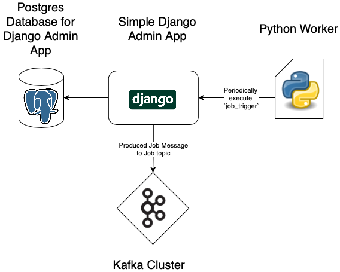
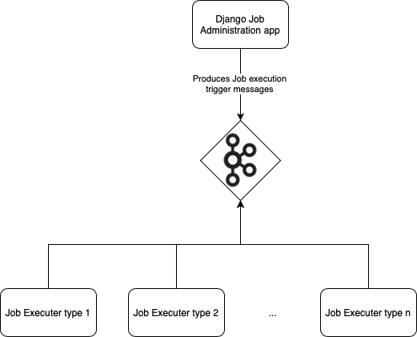

# Django Job Application

It's a raw application for managing jobs which should be executed
in the given Microservice-structure of `JangasNLPFunPlace`.

Only django admin is used for simplifying that process.




## Use Case

This application will produce messages into a kafka cluster.
These job messages will be consumed by different job executors.

Message-format:
- `title` - title for job
- `job_type` - type of job
- `configs` - configs for job

The messages will be periodically fetched from database on rule:
```
# app/job/management/commands/job_trigger.py

Job.objects.filter(is_active=True, next_execution__lte=now())
```

The command `python manage.py job_trigger` is periodically executed
of the python worker which runs in a different thread if enabled.




## Setup & Requirements

There are two possible ways for setting up the application:
1. Docker
2. Python


### Requirements (Python)

- Python 3.7 or higher
- Postgres Database
- poetry or pip


### Requirements (Production)

These Requirements should be seperatly running from this django
application in production. **If you run this in local standalone
mode: these tools are also included in docker composition**
- Postgres Database
- Kafka Cluster


### Setup (Python)

1. Install requirements `poetry install` or
    `pip install -r requirements.txt`
2. Update env file: `cp app/.env.example app/.env`. You need to
    update postgres credentials, kafka credentials and superuser info
3. Migrate the database `python app/manage.py migrate`
4. Create superuser `python app/manage.py initialsuperuser`
5. Runserver `python app/manage.py runserver`
6. Open http://localhost:8000/
7. Have fun


### Setup (Docker)

1. Update .env.docker file: `cp app/.env.example app/.env.docker`.
    You need to update superuser information
2. start the docker composition: `docker-compose up -d`
3. Open http://localhost:8000/
4. Have fun


### env Parameter

- `SECRET_KEY` - Change for production! not relevant for development
- `DEBUG` - Use False in production. True recommended for development
- `ALLOWED_HOSTS` - space separated list of allowed hosts where
    server can run at.
- `POSTGRES_SSL_REQUIRED` - if True `'sslmode': 'require'` will be
    used in database connector
- `INITIAL_SUPERUSER_NAME` - username for root user on
    `initialsuperuser` command
- `INITIAL_SUPERUSER_PASSWORD` - password for root user on
    `initialsuperuser` command
- `KAFKA_ENABLED` - if true: make sure that a kafka cluster is running
    if false: kafka is just included via logs but no messages will
    be sended to a kafka broker
- `RELATIVE_PATH_TO_APP` - relative path to django app directory.
    Hint: it's the directory prefix of your manage.py command. Leave
    empty if you start django directly from app directory
- `WORKER_EXECUTION_INTERVALL_IN_SECONDS` - sleep time for worker
- `WORKER_ENABLED` - if true: Worker will run at manage.py command.


## Job message formats

### YouTube
```
{
  "type": "{{CHANNEL || VIDEO}}",
  "id": "{{ channel id || video id }}",
  "intention": "{{ intention for scraper }}",
  "google_api_key": "{{ Google API Key to use }}",
  "labelizer": {{True || False}}
}
```
